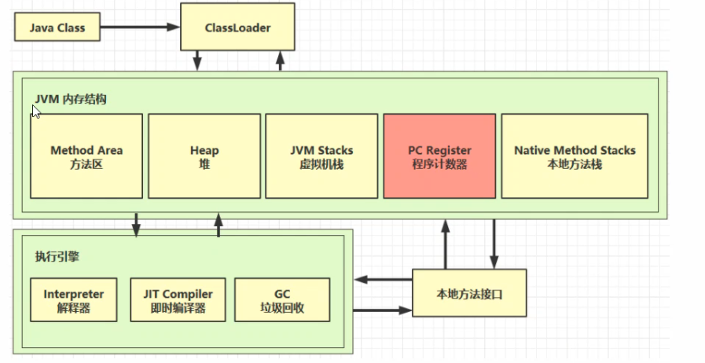
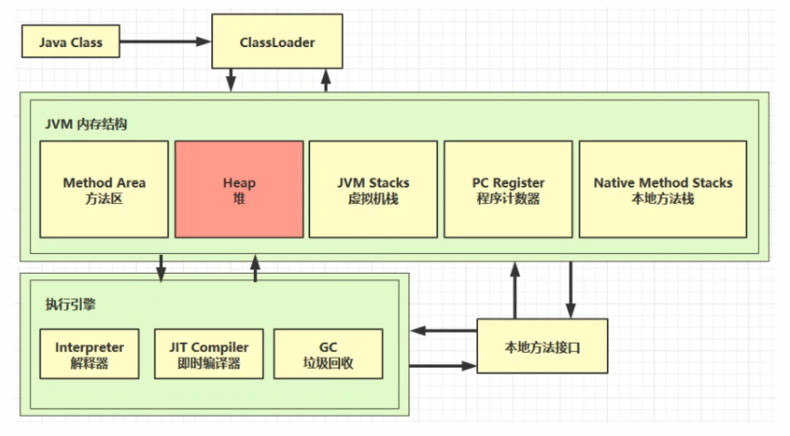

---

title: JVM原理
date: 2022-04-03 15:18:05
author: Guaniu
cover: true
toc: true
summary: 黑马程序员视频课程随堂笔记：https://www.bilibili.com/video/BV1yE411Z7AP?p=1
categories: Java
tags:
  - Java
  - JVM
---

## 什么是JVM？

定义：

Java Virtual Machine - Java程序的运行环境（java二进制字节码的运行环境）

好处：

1）一次编程，到处运行

2）自动内存管理，垃圾回收功能

3）数组下标越界检查

4） 多态

比较：

JVM JRE JDK

## 学习 JVM 有什么用 ?

- 面试 
- 理解底层的实现原理 
- 中高级程序员的必备技能

## 常见的JVM

JVM是一套规范，可以有多种实现

## JVM学习路线

## 内存结构

### 1. 程序计数器

#### 定义

Program Counter Register 程序计数器（寄存器）

~~~java
0: getstatic #20 			// PrintStream out = System.out;
3: astore_1 				// --
4: aload_1 					// out.println(1);
5: iconst_1 				// --
6: invokevirtual #26 		// --
9: aload_1 					// out.println(2);
10: iconst_2 				// --
11: invokevirtual #26 		// --
14: aload_1 				// out.println(3);
15: iconst_3 				// --
16: invokevirtual #26 		// --
19: aload_1 				// out.println(4);
20: iconst_4 				// --
21: invokevirtual #26 		// --
24: aload_1 				// out.println(5);
25: iconst_5 				// --
26: invokevirtual #26 		// --
29: return
~~~

左侧 二进制字节码 JVM指令             右侧JAVA源代码

Java源代码 --> 二进制字节码 JVM指令 -->(经过解释器) -->机器码 --> CPU

#### 作用

记住下一条JVM指令的执行地址，帮助解释器获取下一条JVM指令位置

在物理层面，计数器是由CPU寄存器实现的

#### 特点

**是线程私有的**

​	在多线程切换的过程可以帮助JVM找回改线程执行的位置

**在JAVA内存结构中唯一不会存在内存溢出的区域**

### 2. 虚拟机栈

虚拟机栈可以认为是线程运行需要的内存空间

####  定义

Java Virtual Machine Stacks (Java虚拟机栈)

- 每个线程运行时所需要的内存，称为虚拟机栈 
- 每个栈由多个栈帧（Frame）组成，对应着每次方法调用时所占用的内存 
- 每个线程只能有一个活动栈帧，对应着当前正在执行的那个方法

#### 问题辨析 

##### 1. 垃圾回收是否涉及栈内存？ 

不需要，栈帧内存在方法调用结束后会被弹出。垃圾回收只在堆内存内。

##### 2.栈内存分配越大越好吗？ 

在运行JVM参数设置-Xss size来手动配置栈内存。

如果不设置在各个平台的默认值：

Linux (64 bit) : 1024KB

macOs(64 bit) : 1024KB

Windows: The defalut value depends on virtual memory

~~~java
//配置虚拟机栈大小
-Xss 1m
-Xss 1024K
~~~

栈的内存越大，会导致线程数量变少，所以不是栈内存越大越好。这块内容可以结合操作系统的课程一块理解

##### 3.方法内的局部变量是否线程安全？ 

从两个方面考虑：

**如果方法内局部变量没有逃离方法的作用访问，它是线程安全的** 

**如果是局部变量引用了对象，并逃离方法的作用范围，需要考虑线程安全**

~~~java
public class test{
    //多个线程同时执行这个方法
    static void m1(){
        int x = 0;
        for(int i=0; i<5000; i++){
            x++;
        }
        System.out.println(x);
    }
    
}
~~~

上面这个方法的x变量执行范围一直在本方法内，没有对作用域外的内容产生联系，所以线程安全

~~~java
public class test{
    //多个线程同时执行这个方法
    static int x = 0;
    static void m1(){
        for(int i=0; i<5000; i++){
            x++;
        }
        System.out.println(x);
    }
    
}
~~~

上面这个例子，x变量是static变量了，属于跟着类走了，所以会产生线程安全问题

类的静态变量存放在方法区。方法区是线程共享的。

~~~java
public class Demo1_17 {
    public static void main(String[] args) {
        StringBuilder sb = new StringBuilder();
        sb.append(4);
        sb.append(5);
        sb.append(6);
        new Thread(()->{
            m2(sb);
        }).start();
    }

    public static void m1() {
        StringBuilder sb = new StringBuilder();
        sb.append(1);
        sb.append(2);
        sb.append(3);
        System.out.println(sb.toString());
    }

    public static void m2(StringBuilder sb) {
        sb.append(1);
        sb.append(2);
        sb.append(3);
        System.out.println(sb.toString());
    }

    public static StringBuilder m3() {
        StringBuilder sb = new StringBuilder();
        sb.append(1);
        sb.append(2);
        sb.append(3);
        return sb;
    }
}
~~~

在上面这个例子中：

m1方法的sb变量是局部变量，并且没有返回。所以不会有线程安全问题。

m2会造成线程安全问题。因为sb由外部导入，可以有多个线程访问到他。改用StringBuffer可以杜绝这个问题。

m3方法和m1相似，但是会有线程安全问题，因为他把sb返回了。返回后别的线程可能对其进行修改。

**总结：**

看一个变量是否线程安全不仅仅要看他是不是方法内的局部变量，**还要看他是否逃离了方法的作用范围（m3方法中的return）**

#### 栈内存溢出

**栈帧过多导致栈内存溢出** 

这种情况通常在方法的递归调用中，没有设置正确的结束条件。

~~~java
/**
 * 演示栈内存溢出 java.lang.StackOverflowError
 * -Xss256k
 */
public class Demo1_2 {
    private static int count;

    public static void main(String[] args) {
        try {
            method1();
        } catch (Throwable e) {
            e.printStackTrace();
            System.out.println(count);
        }
    }

    private static void method1() {
        count++;
        method1();
    }
}
~~~

下面这个Demo中可以看到新建一个部门列表时会创建员工列表。而员工属性中的部门属性又会创建员工列表，无限互相引用导致内存溢出。

**解决办法：**

利用@ @JsonIgnore 停止员工对象对部门属性的创建。

~~~java
public class Demo1_19 {

    public static void main(String[] args) throws JsonProcessingException {
        Dept d = new Dept();
        d.setName("Market");

        Emp e1 = new Emp();
        e1.setName("zhang");
        e1.setDept(d);

        Emp e2 = new Emp();
        e2.setName("li");
        e2.setDept(d);

        d.setEmps(Arrays.asList(e1, e2));

        // { name: 'Market', emps: [{ name:'zhang', dept:{ name:'', emps: [ {}]} },] }
        ObjectMapper mapper = new ObjectMapper();
        System.out.println(mapper.writeValueAsString(d));
    }
}

class Emp {
    private String name;
    @JsonIgnore
    private Dept dept;

    public String getName() {
        return name;
    }

    public void setName(String name) {
        this.name = name;
    }

    public Dept getDept() {
        return dept;
    }

    public void setDept(Dept dept) {
        this.dept = dept;
    }
}
class Dept {
    private String name;
    private List<Emp> emps;

    public String getName() {
        return name;
    }

    public void setName(String name) {
        this.name = name;
    }

    public List<Emp> getEmps() {
        return emps;
    }

    public void setEmps(List<Emp> emps) {
        this.emps = emps;
    }
}
~~~

**栈帧过大导致栈内存溢出**

一般不太出现这种情况哦。

#### 线程运行诊断

##### **案例1： CPU 占用过多**

定位方法

用top定位哪个进程对cpu的占用过高

ps H -eo pid,tid,%cpu | grep 进程id （用ps命令进一步定位是哪个线程引起的cpu占用过高） 

jstack 进程id ，上面ps显示的线程编号是十进制的，jstack显示的线程编号的十六进制的，所以定位的时候需要转换下

可以根据线程id 找到有问题的线程，进一步定位到问题代码的源码行号

​	

##### 案例2：程序运行很长时间没有结果

同样使用jstack+进程id来查看线程详细情况。可以尝试看最后一段报告：

### 3. 本地方法栈

 

### 4. 堆

#### 定义

Heap 堆

通过 new 关键字，创建对象都会使用堆内存

特点：

它是线程共享的，堆中对象都需要考虑线程安全的问题 

有垃圾回收机制

#### 堆内存溢出

