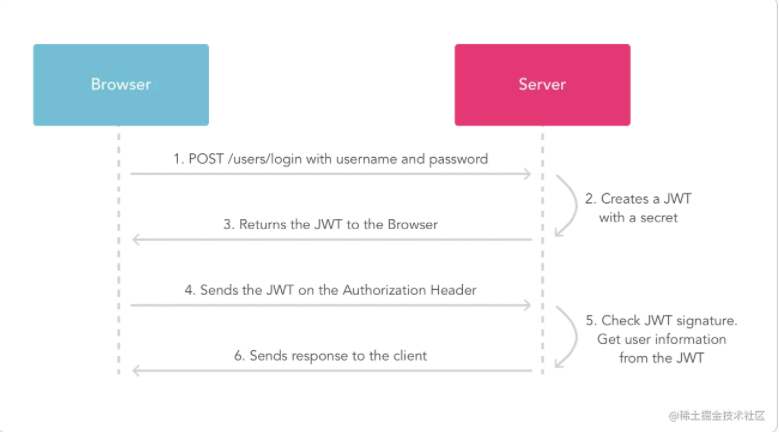

## 详解

简单说，JWT是一个身份认证协议(protocol)，他的优点是简单和对URL安全。另一个优势是**可使服务器免除session存取的压力，同时在集群机或多子站上面，也免除了session需要同步的烦恼。**

以下是JWT认证方式的一个简图

其实我觉得JWT在浏览器环境下与传统的cookie-session方式非常类似，服务器在验证身份之后产生一个cookie与session的关联，即session id，cookie给浏览器存储，session由服务器保存，当需要身份验证时则通过键为session id的cookie获取session，如果拿到正确的session数据则认证成功。

JWT的验证方式中，JWT即扮演cookie的角色（浏览器上通常就是把JWT存cookie）。客户端在需要身份认证的时候则传回JWT，区别就在于服务器端，此时的服务端并不需要通过session来获得身份信息，而是直接提取JWT中的信息。也就是说JWT不是一个简单的token，而是可以把信息(Json格式)编码进去的数据。服务器验证签名相符则表示可使用其携带的数据，否则认证失败。因为信息被编码在JWT中，所以可以免去session查询的消耗。而JWT中的数据需要通过对比签名来确保正确，签名需要的密钥当然只能存在服务器端了。把JWT的下发和验证逻辑都在服务端处理，这是保证安全的关键。

## 实现方法

首先举个栗子，这是一个JWT。

eyJhbGciOiJIUzI1NiIsInR5cCI6IkpXVCJ9.

eyJzdWIiOiIxMjM0NTY3ODkwIiwibmFtZSI6IkpvaG4gRG9lIiwiYWRtaW4iOnRydWV9.TJVA95OrM7E2cBab30RMHrHDcEfxjoY

ZgeFONFh7HgQ

它是以下三块数据通过base64之后拼接而成的。

header.payload.signature

下面分别说明

### **头部（header）：**

~~~
{
    "alg" : "AES256",
    "typ" : "JWT"
}
~~~

alg用来声明用何种哈希算法，细节见下。

### **荷载（payload）：**

荷载就是携带的数据，有部分官方定义的标准字段，也可以加入自己的数据。

~~~
{
"sub": "1234567890",
"name": "John Doe",
"admin": true
}
~~~

其中sub是标准字段，常用的标准字段有

- `iss`: 该JWT的签发者
- `sub`: 该JWT所面向的用户
- `aud`: 接收该JWT的一方
- `exp`(expires): 什么时候过期，这里是一个Unix时间戳
- `iat`(issued at): 在什么时候签发的

name,admin都是自定义的数据，这里可以加入任何内容，但是注意这些数据都是公开的，不可以加入敏感信息。

这个例子有个安全隐患就是没有设置有效期，这样便可以无限制使用了。应该加上exp或iat。

### 签名（signature）

这便是JWT认证的安全核心。因为base64编码基本等于公开，也很容易被篡改，如何保证可信。那就在签名上面。签名是头部（header）、荷载（payload）与一个密钥产生的哈希值。纵然前面的数据很容易被篡改，可是如果不知道签名的密钥则很难保证签名正确。

## 几个安全要点

不要加入敏感信息在荷载数据中，因为base64可以无障碍解码。

密钥一定保管好，只能存在服务器。因为安全的核心在签名，签名的核心在密钥。

荷载中要加入过期时间或生成时间。因为**服务器不储存状态**（这也是JWT认证的一个特点），所以无法判断它的有效期。

为防止XSS如果JWT是存Cookie最好为cookie加HttpOnly属性。

## 和Token方式的区别

**Token** 

概念： 令牌， 是访问资源的凭证。

Token的认证流程：

1. 用户输入用户名和密码，发送给服务器。

2. 服务器验证用户名和密码，正确的话就返回一个签名过的token（token 可以认为就是个长长的字符串），浏览器客户端拿到这个token。

3. 后续每次请求中，浏览器会把token作为http header发送给服务器，服务器验证签名是否有效，如果有效那么认证就成功，可以返回客户端需要的数据。

特点：

  这种方式的特点就**是客户端的token中自己保留有大量信息，服务器没有存储这些信息**。

**JWT**

JWT是json web token缩写。它将用户信息加密到token里，服务器不保存任何用户信息。服务器通过使用保存的密钥验证token的正确性，只要正确即通过验证。

例如下面这个例子：

假如payload部分如下：

~~~
 {

 "exp": 1518624000,

 "isVip": true,

 "uid":1

 }
~~~

1. 解析JWT

2. 判断签名是否正确，根据生成签名时使用的密钥和加密算法，只要这一步过了就说明是payload是可信的

3. 判断JWT token是否过期，根据exp，判断是否是VIP，根据isVip

JWT版是没有查库的，他所需要的基础信息可以直接放到JWT里，服务端只要判断签名是否正确就可以判断出该用户是否可以访问该接口，当然JWT里的内容也不是无限多的，其他更多的信息我们就可以通过id去查数据库

[JWT(JSON Web Token) 原理简析 - 掘金 (juejin.cn)](https://juejin.cn/post/7002904348212592654)

[JWT和token的区别及优缺点 - 涛子17180 - 博客园 (cnblogs.com)](https://www.cnblogs.com/chentao17180/p/14514494.html)
