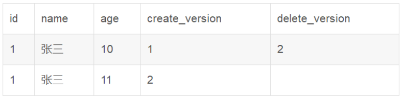

## 快速理解脏读、不可重复读、幻读和MVCC

### **脏读（读取未提交数据）**

A事务读取B事务尚未提交的数据，此时如果B事务发生错误并执行回滚操作，那么A事务读取到的数据就是脏数据。就好像原本的数据比较干净、纯粹，此时由于B事务更改了它，这个数据变得不再纯粹。这个时候A事务立即读取了这个脏数据，但事务B良心发现，又用回滚把数据恢复成原来干净、纯粹的样子，而事务A却什么都不知道，最终结果就是事务A读取了此次的脏数据，称为脏读。

这种情况常发生于转账与取款操作中

### **不可重复读（前后多次读取，数据内容不一致）**

事务A在执行读取操作，由整个事务A比较大，前后读取同一条数据需要经历很长的时间 。而在事务A第一次读取数据，比如此时读取了小明的年龄为20岁，事务B执行更改操作，将小明的年龄更改为30岁，此时事务A第二次读取到小明的年龄时，发现其年龄是30岁，和之前的数据不一样了，也就是数据不重复了，系统不可以读取到重复的数据，成为不可重复读。

### **幻读（前后多次读取，数据总量不一致）**

事务A在执行读取操作，需要两次统计数据的总量，前一次查询数据总量后，此时事务B执行了新增数据的操作并提交后，这个时候事务A读取的数据总量和之前统计的不一样，就像产生了幻觉一样，平白无故的多了几条数据，称为幻读。

### **不可重复读和幻读到底有什么区别呢？**

(1) 不可重复读是读取了其他事务更改的数据，针对update操作

解决：**使用行级锁，锁定该行，事务A多次读取操作完成后才释放该锁**，这个时候才允许其他事务更改刚才的数据。

(2) 幻读是读取了其他事务新增的数据，针对insert和delete操作

解决**：使用表级锁，锁定整张表，事务A多次读取数据总量之后才释放该锁**，这个时候才允许其他事务新增数据。

### **数据库事务的四大特性**

1、原子性：事务包含的所有数据库操作要么全部成功，要不全部失败回滚

2、一致性：一个事务执行之前和执行之后都必须处于一致性状态。拿转账来说，假设用户A和用户B两者的钱加起来一共是5000，那么不管A和B之间如何转账，转几次账，事务结束后两个用户的钱相加起来应该还得是5000，这就是事务的一致性。

3、隔离性：一个事务未提交的业务结果是否对于其它事务可见。级别一般有：read_uncommit，read_commit，read_repeatable，Serializable 串行化访问。

4、持久性：一个事务一旦被提交了，那么对数据库中数据的改变就是永久性的，即便是在数据库系统遇到故障的情况下也不会丢失提交事务的操作。

### **数据库的隔离级别**

数据库事务的隔离级别有4个，由低到高依次为**Read uncommitted 、Read committed 、Repeatable read 、Serializable** ，这四个级别可以逐个解决脏读 、不可重复读 、幻读 这几类问题。

### **1. Read uncommitted 读未提交**

公司发工资了，领导把5000元打到singo的账号上，但是该事务并未提交，而singo正好去查看账户，发现工资已经到账，是5000元整，非常高 兴。可是不幸的是，领导发现发给singo的工资金额不对，是2000元，于是迅速回滚了事务，修改金额后，将事务提交，最后singo实际的工资只有 2000元，singo空欢喜一场。

出现上述情况，即我们所说的脏读 ，两个并发的事务，“事务A：领导给singo发工资”、“事务B：singo查询工资账户”，事务B读取了事务A尚未提交的数据。

当隔离级别设置为Read uncommitted 时，就可能出现脏读，如何避免脏读，请看下一个隔离级别。

### **2. Read committed 读提交**

singo拿着工资卡去消费，系统读取到卡里确实有2000元，而此时她的老婆也正好在网上转账，把singo工资卡的2000元转到另一账户，并在 singo之前提交了事务，当singo扣款时，系统检查到singo的工资卡已经没有钱，扣款失败，singo十分纳闷，明明卡里有钱，为何......

出现上述情况，即我们所说的不可重复读 ，两个并发的事务，“事务A：singo消费”、“事务B：singo的老婆网上转账”，事务A事先读取了数据，事务B紧接了更新了数据，并提交了事务，而事务A再次读取该数据时，数据已经发生了改变。

当隔离级别设置为Read committed 时，避免了脏读，但是可能会造成不可重复读。

**大多数数据库的默认级别就是Read committed，比如Sql Server , Oracle。**如何解决不可重复读这一问题，请看下一个隔离级别。

### **3. Repeatable read 重复读**

在对于数据库中的某个数据，一个事务范围内多次查询却返回了不同的数据值，这是由于在查询间隔，被另一个事务修改并提交了。

当隔离级别设置为Repeatable read 时，可以避免不可重复读。当singo拿着工资卡去消费时，一旦系统开始读取工资卡信息（即事务开始），singo的老婆就不可能对该记录进行修改，也就是singo的老婆不能在此时转账。

虽然Repeatable read避免了不可重复读，但还有可能出现幻读 。

singo的老婆工作在银行部门，她时常通过银行内部系统查看singo的信用卡消费记录。有一天，她正在查询到singo当月信用卡的总消费金额 （select sum(amount) from transaction where month = 本月）为80元，而singo此时正好在外面胡吃海塞后在收银台买单，消费1000元，即新增了一条1000元的消费记录（insert transaction ... ），并提交了事务，随后singo的老婆将singo当月信用卡消费的明细打印到A4纸上，却发现消费总额为1080元，singo的老婆很诧异，以为出 现了幻觉，幻读就这样产生了。

**注：Mysql的默认隔离级别就是Repeatable read。**

**不可重复读和脏读的区别是**：脏读是某一事务读取了另一个事务未提交的脏数据，而不可重复读则是读取了前一事务提交的数据。

幻读和不可重复读都是读取了另一条已经提交的事务（这点就脏读不同），所不同的是不可重复读查询的都是**同一个数据项**，而幻读针对的是**一批数据整体**（比如数据的个数）。

### **4. Serializable 序列化（串行化）**

Serializable 是最高的事务隔离级别，同时代价也花费最高，性能很低，一般很少使用，在该级别下，事务顺序执行，不仅可以避免脏读、不可重复读，还避免了幻读。

### **悲观锁和乐观锁**

#### **悲观锁**

正如其名，它指的是对数据被外界（包括本系统当前的其他事务，以及来自外部系统的事务处理）修改持保守态度，因此，在整个数据处理过程中，将数据处 于锁定状态。

悲观锁的实现，往往依靠数据库提供的锁机制（也只有数据库层提供的锁机制才能真正保证数据访问的排他性，否则，即使在本系统中实现了加锁机 制，也无法保证外部系统不会修改数据）。

在悲观锁的情况下，为了保证事务的隔离性，就需要一致性锁定读。读取数据时给加锁，其它事务无法修改这些数据。修改删除数据时也要加锁，其它事务无法读取这些数据。

#### **乐观锁**

相对悲观锁而言，乐观锁机制采取了更加宽松的加锁机制。悲观锁大多数情况下依靠数据库的锁机制实现，以保证操作最大程度的独占性。但随之而来的就是数据库性能的大量开销，特别是对长事务而言，这样的开销往往无法承受。

而乐观锁机制在一定程度上解决了这个问题。乐观锁，大多是基于数据版本（ Version ）记录机制实现。

何谓数据版本？即为数据增加一个版本标识，在基于数据库表的版本解决方案中，一般是通过为数据库表增加一个 “version” 字段来实现。读取出数据时，将此版本号一同读出，之后更新时，对此版本号加一。

此时，将提交数据的版本数据与数据库表对应记录的当前版本信息进行比对，如 果提交的数据版本号大于数据库表当前版本号，则予以更新，否则认为是过期数据。

### **MVCC（多版本并发控制）**

英文全称为Multi-Version Concurrency Control，乐观锁为理论基础的MVCC（多版本并发控制），MVCC的实现没有固定的规范。每个数据库都会有不同的实现方式。

mysql中，默认的事务隔离级别是可重复读（repeatable-read），为了解决不可重复读，innodb采用了MVCC（多版本并发控制）来解决这一问题。

MVCC是利用在每条数据后面加了隐藏的两列（创建版本号和删除版本号），每个事务在开始的时候都会有一个递增的版本号

**新增：**

insert into user (id,name,age)values(1,"张三",10);

**更新：**

update user set age = 11 where id = 1;

更新操作采用delete+add的方式来实现，首先将当前数据标志为删除

然后新增一条新的数据：

**删除：**删除操作是直接将数据的删除版本号更新为当前事务的版本号

delete from user where id = 1;

**查询操作：**

查询操作为了避免查询到旧数据或已经被其他事务更改过的数据，需要满足如下条件：

1、查询时当前事务的版本号需要大于或等于创建版本号

2、查询时当前事务的版本号需要小于删除的版本号

即：create_version <=  current_version  <  delete_version

**补充：**

1.MVCC手段只适用于Msyql隔离级别中的读已提交（Read committed）和可重复读（Repeatable Read）.

2.Read uncimmitted由于存在脏读，即能读到未提交事务的数据行，所以不适用MVCC.

原因是MVCC的创建版本和删除版本只要在事务提交后才会产生。

3.串行化由于是会对所涉及到的表加锁，并非行锁，自然也就不存在行的版本控制问题。

4.通过以上总结，可知，MVCC主要作用于事务性的，有行锁控制的数据库模型。

[(65条消息) 快速理解脏读、不可重复读、幻读和MVCC_互扯程序的博客-CSDN博客](https://blog.csdn.net/mxw2552261/article/details/93263578)
